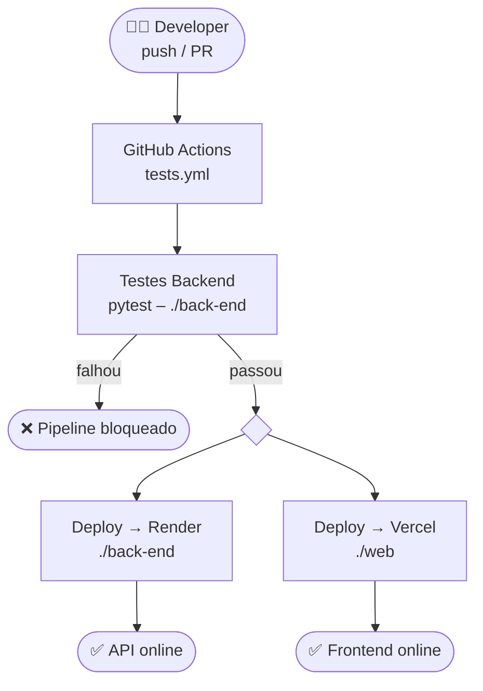

# Pipeline de Deploy

## Resumo

| Etapa | Ferramenta | Pasta |
|---|---|---|
| Testes | GitHub Actions (`tests.yml`) | `./back-end` |
| Backend | Render | `./back-end` |
| Frontend | Vercel | `./web` |
